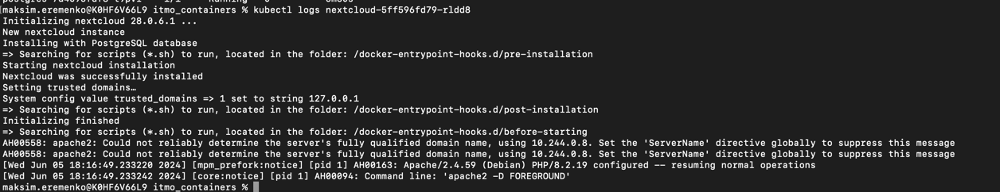

Шаг 1 Установка kubectl и minikube и запуск

Шаг 2 Запуск nextcloud с дефолтными параметрами
  

Логи nextcloud 

Шаг 3 добавление проб в nextcloud и перенос секретов

Описание поды nextcloud 

Ответы на вопросы:  
**Важен ли порядок выполнения этих манифестов? Почему?**
Важен, если один манифест зависит от старта другого (аналог depends on из docker-compose). Если не запустить изначально pg_secret, то деплоймент упадет с ошибкой, так как ссылается на данный манифест в своих переменных  

**Что произойдет, если масштабировать реплики postgres-deployment до 0, а затем обратно до 1?**  
Маштабирование реплик до 0 фактически равно удалению бд postgres, из-за чего nexcloud будет выдавать ошибку (если нет реплик, то и подключаться не к чему).  
При обратном маштабировании на 1, postgres опять развернется с нуля, так как в данном случае у нас не подключены volume, то никаких данных в бд не будет и nextcloud все равно будет выдавать ошибку

